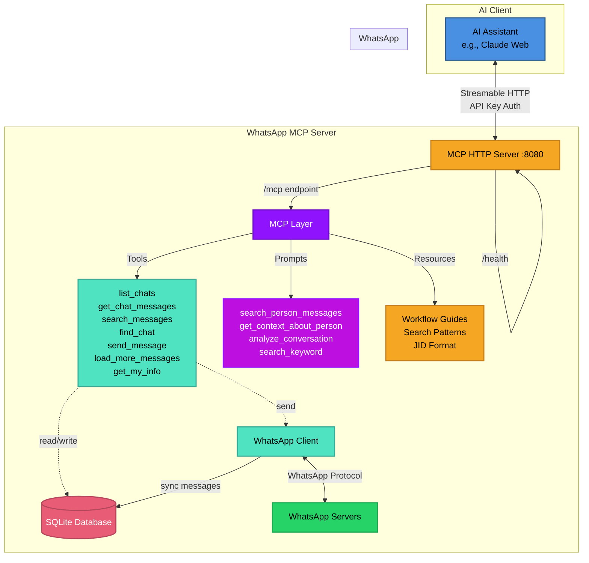

<div align="center">

# WhatsApp MCP Server

**Give AI assistants access to your WhatsApp conversations**

[](https://go.dev/)
[](https://modelcontextprotocol.io)
[](https://www.docker.com/)
[](LICENSE)
[](https://deepwiki.com/felipeadeildo/whatsapp-mcp)

*Built with [whatsmeow](https://github.com/tulir/whatsmeow) and [mcp-go](https://github.com/mark3labs/mcp-go)*

[Features](#-features) • [Quick Start](#-quick-start) • [Architecture](#-architecture) • [MCP Integration](#-mcp-integration)

</div>

## 🎯 What is This?

A **Model Context Protocol (MCP) server** that bridges WhatsApp and AI assistants like Claude. It exposes your WhatsApp messages through standardized MCP tools, prompts, and resources - allowing AI to read, search, and send messages on your behalf.

**The Vision:** Let AI handle your WhatsApp conversations intelligently, with full context and natural language understanding.

```
You: "Summarize what João said about the budget meeting"
AI:  *searches all your chats* → "João mentioned in the Tech Team group..."

You: "Reply to Maria's last message and schedule lunch"
AI:  *reads context, sends reply* → "Sent! I've proposed Thursday at noon"
```

## ✨ Features

### Core Capabilities

- **📱 Full WhatsApp Integration** - Connect to WhatsApp Web using your existing account
- **💾 Local-First Storage** - All messages stored in SQLite, synced in real-time
- **🔍 Powerful Search** - Pattern matching, cross-chat queries, sender filtering
- **⏱️ Timezone Support** - Messages displayed in your local timezone
- **📥 On-Demand Loading** - Fetch older messages from WhatsApp servers as needed
- **🔐 Secure by Design** - API key authentication, local data storage, HTTPS ready

### MCP Features

This server implements the full MCP specification with:

- **7 Tools** for WhatsApp operations
- **4 Prompts** for common workflows
- **4 Resources** for interactive guides
- **Server Instructions** for optimal AI interactions

#### Tools

| Tool | Purpose | Highlights |
|------|---------|-----------|
| `list_chats` | Browse conversations | Ordered by recent activity |
| `get_chat_messages` | Read specific chat | Pagination, sender filtering |
| `search_messages` | Search across all chats | Pattern matching, wildcards |
| `find_chat` | Locate chat by name | Fuzzy search support |
| `send_message` | Send WhatsApp messages | To any chat or group |
| `load_more_messages` | Fetch older history | On-demand from servers |
| `get_my_info` | Get your profile info | JID, name, status, picture |

#### Prompts

Pre-built workflows that guide AI assistants:

- **`search_person_messages`** - Find ALL messages from someone across all chats
- **`get_context_about_person`** - Comprehensive analysis of someone's messages
- **`analyze_conversation`** - Summarize recent chat activity
- **`search_keyword`** - Find specific topics across conversations

#### Resources

Interactive documentation embedded in the MCP server:

- **Cross-Chat Search Guide** - Master advanced search workflows
- **Workflow Guide** - Common operations and best practices
- **JID Format Guide** - Understanding WhatsApp identifiers
- **Search Patterns Guide** - Wildcards and pattern matching

## 🏗️ Architecture



### How It Works

1. **Initial Sync** - WhatsApp sends message history on first connection
2. **Real-Time Updates** - All new messages automatically stored in SQLite
3. **MCP Exposure** - Tools, prompts, and resources expose functionality to AI
4. **On-Demand Loading** - Fetch older messages from WhatsApp when needed
5. **AI Integration** - Claude (or any MCP client) accesses WhatsApp through standardized protocol

## 🚀 Quick Start

### Prerequisites

- **Go 1.25.5+** (for local setup) or **Docker** (recommended)
- **WhatsApp account** (will be linked via QR code)
- **MCP-compatible AI client** (Claude, Cursor, etc.)

### Option 1: Docker Setup (Recommended)

1. **Clone and configure**
   ```bash
   git clone https://github.com/felipeadeildo/whatsapp-mcp
   cd whatsapp-mcp
   cp .env.example .env
   # Edit .env with your settings (API key, timezone, etc.)
   ```

2. **Start the server**
   ```bash
   docker compose up -d
   ```

3. **Link WhatsApp**
   ```bash
   # View logs to see QR code
   docker compose logs -f whatsapp-mcp

   # Scan QR code with WhatsApp mobile app:
   # Settings → Linked Devices → Link a Device
   ```

4. **Verify it's running**
   ```bash
   curl http://localhost:8080/health
   # Expected: "OK"
   ```

### Option 2: Local Setup

1. **Install dependencies**
   ```bash
   git clone https://github.com/felipeadeildo/whatsapp-mcp
   cd whatsapp-mcp
   go mod download
   ```

2. **Configure environment**
   ```bash
   cp .env.example .env
   # Edit .env with your settings
   ```

3. **Run the server**
   ```bash
   go run main.go
   ```

4. **Link WhatsApp** (scan QR code shown in terminal)

## 🔌 MCP Integration

### Connect to Claude Desktop

Add to your Claude Desktop config (`~/Library/Application Support/Claude/claude_desktop_config.json`):

```json
{
  "mcpServers": {
    "whatsapp": {
      "type": "http",
      "url": "http://localhost:8080/mcp",
      "headers": {
        "Authorization": "Bearer your-secret-api-key"
      }
    }
  }
}
```

### Connect to Other MCP Clients

The server exposes a Streamable HTTP endpoint compatible with any MCP client:

- **URL:** `http://localhost:8080/mcp`
- **Transport:** Streamable HTTP
- **Authentication:** Two methods supported (Bearer header preferred)

**Option A — Authorization header (recommended):**

Keeps the key out of URLs, proxy logs, and shell history.

```json
{
  "mcpServers": {
    "whatsapp": {
      "type": "http",
      "url": "http://localhost:8080/mcp",
      "headers": {
        "Authorization": "Bearer your-secret-api-key"
      }
    }
  }
}
```

**Option B — Key in URL path (backward compatible):**

Existing clients using `/mcp/{key}` continue to work unchanged.

```json
{
  "mcpServers": {
    "whatsapp": {
      "url": "http://localhost:8080/mcp/your-secret-api-key",
      "type": "http"
    }
  }
}
```

## 🎨 Usage Examples

Once connected, your AI assistant can:

### Search for People
```
You: "Find all messages from Arthur across all my chats"
AI: [Uses search_person_messages prompt]
    → Finds messages in DMs, groups, everywhere
    → Analyzes communication patterns
    → Provides context about Arthur
```

### Analyze Conversations
```
You: "What did we discuss in the Tech Team group this week?"
AI: [Uses analyze_conversation prompt]
    → Reads recent messages
    → Summarizes key topics
    → Lists action items and deadlines
```

### Smart Messaging
```
You: "Tell Maria I'll be 10 minutes late"
AI: [Uses find_chat + send_message]
    → Finds Maria's chat
    → Sends contextual message
    → Confirms delivery
```

### Deep Search
```
You: "Find all mentions of 'budget meeting' in any chat"
AI: [Uses search_keyword prompt]
    → Searches across all conversations
    → Shows context around each mention
    → Orders by relevance/date
```

## 📲 Import from the WhatsApp Desktop App (macOS & Windows)

The whatsmeow history sync can only retrieve a limited window of history. The
**WhatsApp desktop app**, however, keeps your *full* local history on disk. The
`localimport` tool reads that and merges it into `messages.db`, so the locally
installed app can act as a richer source of messages — typically tens of
thousands of messages further back than the live sync reaches. On **macOS** it
reads the app's SQLite database directly (below); on **Windows** the data is
encrypted and needs a short extraction first ([see Windows](#windows)).

> **Run it on the Mac itself**, not inside Docker — the WhatsApp app's data lives
> in your user Library and isn't visible to the container. Point `--db` at the
> same `messages.db` your server uses.

```bash
# 1. See what would be imported (no writes)
go run ./cmd/localimport --dry-run

# 2. Merge the local app's history into data/db/messages.db
go run ./cmd/localimport

# Useful flags:
#   --src <path>        ChatStorage.sqlite (default: the standard macOS location)
#   --lid <path>        LID.sqlite (default: sibling of --src)
#   --db <path>         destination messages.db (default: ./data/db/messages.db)
#   --me <number>       your own phone/JID (default: auto-detected)
#   --since 2025-01-01  only import messages on/after a date
#   --chat <jid>        only import a single chat
#   --include-system    include group/system event messages
#   --no-copy           read the live DB in place (default copies a snapshot first)
#   --no-overwrite      only insert messages the DB lacks; never overwrite existing
#                       rows (but do upgrade [Protocol]-style placeholders to real text)
```

> **`--no-overwrite`** is the safe choice when a live sync has already populated
> `messages.db`: it adds only the history the DB is missing and recovers the real
> text behind `[Protocol]`/`[Unknown message type]`/media placeholders, without
> replacing any message the live sync already captured.

The import is **idempotent** — messages are keyed by their WhatsApp IDs, so it
safely overlaps with the live sync and can be re-run any time. By default it
reads a temporary snapshot of the app's databases so it never disturbs a running
WhatsApp app. It does **not** copy media files (they stay in the app's own
store); media attachments are recorded as metadata with status `external`.

How the format was reverse-engineered and exactly how identities/timestamps are
mapped is documented in [`localapp/README.md`](localapp/README.md).

### Windows

The **native WhatsApp for Windows app** also keeps your full local history, but
stores it encrypted and split across a SQLCipher database (message text) and a
WebView2 IndexedDB (rich metadata). Importing it therefore takes a short
two-step extraction first, after which it merges into `messages.db` through the
same idempotent pipeline:

```bash
# 1. Decrypt + extract into an intermediate database (see the guide for details)
python localapp/windows/extract_whatsapp_windows.py \
    --idb <…IndexedDB…> --generic <genericStorage.dec.db> \
    --contacts <contacts.dec.db> --out wa-windows-export.db

# 2. Import it (use -no-overwrite to enrich an existing live-synced DB safely)
go run ./cmd/localimport -platform windows -export wa-windows-export.db -no-overwrite
```

The full procedure (decrypting the SQLCipher store with ZAPiXDESK, locating the
IndexedDB, Python prerequisites and limitations) is in
[`localapp/windows/README.md`](localapp/windows/README.md).

## ☁️ Import from a Google Drive backup (Android)

Don't have the desktop app, but use **WhatsApp on Android**? Your full history is
backed up to **Google Drive**, encrypted end-to-end. Download and decrypt that
backup to get a plaintext **`msgstore.db`**, and the same idempotent pipeline
imports it into `messages.db`.

The download + crypt15 decryption is handled by the maintained
[`wabdd`](https://github.com/giacomoferretti/whatsapp-backup-downloader-decryptor)
tool (just as the Windows path leans on ZAPiXDESK); this project consumes its
decrypted output. You need your **64-digit encryption key** (WhatsApp → Settings
→ Chats → Chat backup → End-to-end encrypted backup → *Use 64-digit key*).

> **The backup must be end-to-end encrypted (`.crypt15`).** A default, non-E2E
> backup is `.crypt14`, which is encrypted with an on-device key `wabdd` can't
> use. If your latest backup is `crypt14`, turn on the E2E encrypted backup and
> let it run once first. See the Android guide for how to check.

```bash
# 1. Install the downloader/decryptor
uv tool install wabdd            # or: pipx install wabdd

# 2. Authenticate to Google (paste the oauth_token cookie when prompted)
wabdd token YOUR_GOOGLE_EMAIL@gmail.com

# 3. Download the backup, then decrypt it with your 64-digit key (in key.txt)
wabdd download --master-token tokens/YOUR_GOOGLE_EMAIL_gmail_com_mastertoken.txt
wabdd decrypt --key-file key.txt dump backups/<phone>_<date>

# 4. Import the decrypted msgstore.db (use -no-overwrite to enrich a live-synced DB)
go run ./cmd/localimport -platform android \
    -msgstore "backups/<phone>_<date>-decrypted/Databases/msgstore.db" -no-overwrite
```

The full procedure (getting the Google token, the encryption key, flags and
limitations — e.g. DM contact names and media files are not part of a Drive
backup) is in [`localapp/android/README.md`](localapp/android/README.md).

## 🗄️ Read-Only Local Mode (no whatsmeow, no second database)

Instead of importing, you can run the MCP server **directly against the native
WhatsApp desktop app's database**. In this mode the server:

- uses **no whatsmeow** and links no WhatsApp account (no QR code),
- keeps **no separate or copied database** — it reads the app's
  `ChatStorage.sqlite` live,
- **never writes** to that database (it is opened strictly read-only), and
- exposes the read tools (`list_chats`, `get_chat_messages`, `search_messages`,
  `find_chat`, `get_my_info`). Sending and live history sync are not available.

This is the simplest way to give an AI assistant access to your **full** WhatsApp
history with zero syncing — the desktop app remains the single source of truth.

```bash
# Run the server in read-only local mode (on the Mac with WhatsApp installed)
WHATSAPP_MODE=local MCP_API_KEY=your-secret-key go run .
```

Then point your MCP client at `http://localhost:8080/mcp` as usual.

> **Run it on the Mac itself, not in Docker** — the app's database lives in your
> user Library and isn't visible to a container. By default it auto-locates the
> standard macOS path; override with `LOCAL_CHATSTORAGE_PATH` if needed.

**How it works:** the server opens `ChatStorage.sqlite` read-only and projects
the app's Core Data tables onto this project's canonical schema using
connection-local SQLite `TEMP` views (which live in temporary space and never
touch the file). `@lid` identities are resolved to phone numbers via `LID.sqlite`,
exactly as in import mode. Because the views present the same `chats` /
`messages_with_names` relations the server already queries, all read tools work
unchanged. Reads reflect the app's live data (committed WAL transactions
included). See [`localapp/README.md`](localapp/README.md) for the schema details.

### Which mode should I use?

| | **Local mode** (`WHATSAPP_MODE=local`) | **Import** (`cmd/localimport`) | **Default** (whatsmeow) |
|---|---|---|---|
| WhatsApp account linked | No | No | Yes (QR) |
| Separate database | No | Yes (`messages.db`) | Yes (`messages.db`) |
| Send messages / live sync | No | No | Yes |
| Full local history | Yes (live) | Yes (snapshot) | Limited by sync |
| Runs in Docker | No (needs the app's files) | No (host only) | Yes |

## 📊 Data & Privacy

### Local Storage

All data is stored in `./data/`:
- **`db/`** - Database files
  - `messages.db` - SQLite database with messages and chats
  - `whatsapp_auth.db` - WhatsApp session credentials
- **`media/`** - Downloaded media files
- **`whatsapp.log`** - WhatsApp client logs

**⚠️ Important:** Database files contain sensitive data. Keep them secure (file permissions `600`) and backed up.

## 🛣️ Roadmap

### ✅ Implemented

- [x] WhatsApp Web integration via whatsmeow
- [x] Real-time message sync to SQLite
- [x] MCP server with Streamable HTTP transport
- [x] Pattern matching and wildcards
- [x] Sender filtering and cross-chat search
- [x] Timestamp-based pagination
- [x] Timezone support
- [x] On-demand message loading from servers
- [x] Docker deployment (with healthcheck!)
- [x] Import full history from the local WhatsApp desktop app (macOS)
- [x] Import full history from the local WhatsApp desktop app (Windows: decrypt + IndexedDB extract)
- [x] Import full history from a Google Drive backup (Android: download + crypt15 decrypt)
- [x] Read-only local mode: serve the native WhatsApp app database directly (no whatsmeow)

### 🚧 Planned

- [ ] **Media Support**
  - Voice message transcription
  - Image OCR and analysis
  - Video metadata extraction
  - Document parsing
  - Contact card handling

- [ ] **GraphRAG Integration**
  - Entity extraction from conversations
  - Relationship mapping between contacts
  - Semantic search capabilities
  - Context-aware recommendations

- [ ] **Enhanced Tools**
  - Mark messages as read
  - React to messages (emoji reactions)
  - Send media files
  - Group management (create, members)
  - Status updates
  - Account management (profile picture, name)

- [ ] **Analytics** (maybe)
  - Message statistics
  - Conversation insights
  - Response time tracking

## 📚 Documentation

### MCP Resources (Built-In)

The server includes interactive guides accessible through MCP:
- **Workflow Guide** - Common operations and patterns
- **Cross-Chat Search** - Master advanced search techniques
- **JID Format Guide** - Understanding WhatsApp identifiers
- **Search Patterns** - Wildcards and pattern matching

AI assistants can access these guides through the MCP Resources API.

### Environment Variables

See `.env.example` and be happy!

## 🔔 Webhook Events

When `WEBHOOK_URL` is set, the server POSTs a JSON payload to that URL for every incoming and outgoing message.

### Payload Structure

```json
{
  "id": "550e8400-e29b-41d4-a716-446655440000",
  "event_type": "message.received",
  "timestamp": "2026-06-14T10:00:00Z",
  "data": {
    "message_id": "3EB0...",
    "chat_jid": "6281234567890@s.whatsapp.net",
    "sender_jid": "6281234567890@s.whatsapp.net",
    "text": "Hello!",
    "timestamp": "2026-06-14T10:00:00Z",
    "is_from_me": false,
    "message_type": "text",
    "chat_name": "John Doe",
    "sender_push_name": "John",
    "sender_contact_name": "John Doe",
    "is_group": false,
    "media_metadata": null,
    "referral": null
  }
}
```

### Fields

| Field | Type | Description |
|---|---|---|
| `id` | string (UUID) | Unique event identifier |
| `event_type` | string | `message.received` or `message.sent` |
| `timestamp` | string (RFC3339) | When the event was generated |
| `data.message_id` | string | WhatsApp message ID |
| `data.chat_jid` | string | JID of the chat (DM or group) |
| `data.sender_jid` | string | JID of the sender |
| `data.text` | string | Message text content |
| `data.timestamp` | string (RFC3339) | When the message was sent |
| `data.is_from_me` | bool | `true` if sent from your account |
| `data.message_type` | string | `text`, `image`, `video`, `audio`, `document`, `sticker`, `ptt`, `gif` |
| `data.chat_name` | string | Display name of the chat (omitted if empty) |
| `data.sender_push_name` | string | WhatsApp display name of the sender (omitted if empty) |
| `data.sender_contact_name` | string | Local contact name for the sender (omitted if empty) |
| `data.is_group` | bool | `true` if the message is in a group chat |
| `data.media_metadata` | object \| null | Present when message has a media attachment (see below) |
| `data.referral` | object \| null | Present when message originated from a Meta Click-to-WhatsApp ad (see below) |

### Media Metadata

Present when `message_type` is `image`, `video`, `audio`, `document`, `sticker`, `ptt`, or `gif`.

```json
"media_metadata": {
  "message_id": "3EB0...",
  "file_name": "photo.jpg",
  "file_size": 204800,
  "mime_type": "image/jpeg",
  "has_media": true
}
```

### Referral (Click-to-WhatsApp Ads)

When a user taps a Meta ad with a "Message on WhatsApp" button, their first message carries ad attribution metadata (`ExternalAdReply` in the WhatsApp protocol). The server extracts this and populates `referral`:

```json
"referral": {
  "ctwa_clid": "ARAkLkA8...",
  "source_id": "120208468219880053",
  "source_type": "AD",
  "source_url": "https://fb.com/ads/...",
  "headline": "Order Now"
}
```

| Field | Description |
|---|---|
| `ctwa_clid` | Meta's click ID — use this for offline conversion attribution via Meta Conversions API |
| `source_id` | The ad ID that originated the conversation |
| `source_type` | Ad placement type (e.g. `AD`) |
| `source_url` | Destination URL of the ad |
| `headline` | Ad creative headline text |

`referral` is `null` for all non-ad messages. It is supported on text, image, and video messages (the message types where WhatsApp carries `ExternalAdReply`).

### Delivery & Retries

Failed deliveries are retried up to `WEBHOOK_MAX_RETRIES` times with exponential backoff. Delivery attempts are logged in the database and visible via the webhook management API (`GET /webhooks/deliveries`).

## 🤝 Contributing

This is a personal project I maintain for daily use. Contributions are welcome!

See [CONTRIBUTING.md](CONTRIBUTING.md) for:
- Development setup and workflow
- Project structure (main server vs migration CLI)
- Database migration system
- Code style guidelines

Quick start:
1. Fork the repository
2. Create your feature branch
3. Follow the guidelines in CONTRIBUTING.md
4. Submit a pull request

## ⚠️ Disclaimer

This project is **not affiliated with WhatsApp or Meta**. It uses the unofficial WhatsApp Web API through the whatsmeow library. Use at your own risk.

**Important Notes:**
- WhatsApp may change their API at any time
- Using unofficial APIs may violate WhatsApp's Terms of Service
- This is provided as-is with no warranties
- Keep your session data secure

---

<div align="center">

**Built with ❤️ for the MCP community**

[Report Bug](https://github.com/felipeadeildo/whatsapp-mcp/issues) • [Request Feature](https://github.com/felipeadeildo/whatsapp-mcp/issues)

</div>
